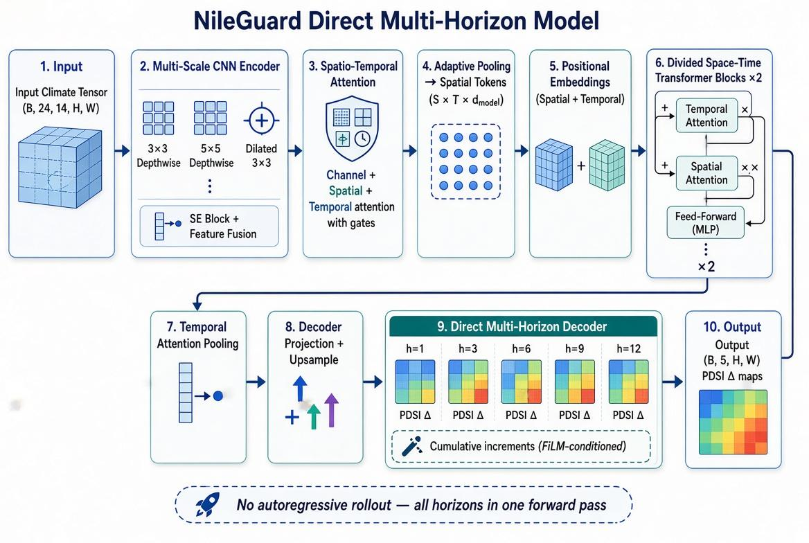
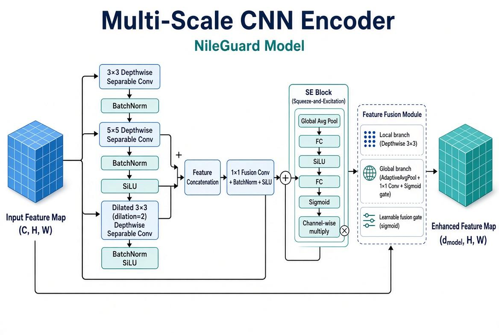
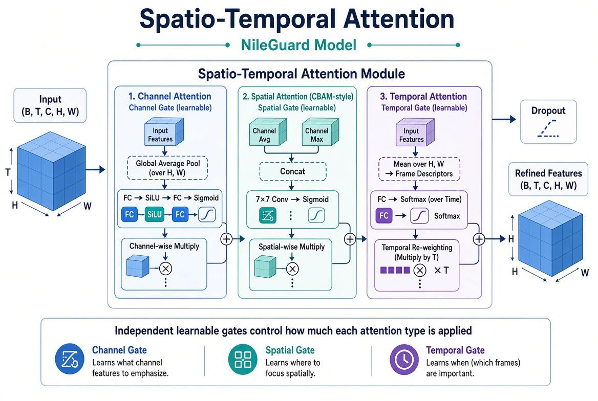

# 🛰️ NileGuard: Spatio-Temporal Deep Learning for Multi-Horizon Drought Forecasting in Egypt

[](#)
[](#)
[](#)
[](#)
[](#)

**A spatio-temporal applied AI framework for forecasting Palmer Drought Severity Index (PDSI) across Upper Egypt using multi-decadal monthly climate data, deep learning, and machine learning.**

**NileGuard** combines spatial climate representations, temporal sequence modeling, engineered drought indicators, and ensemble machine learning to investigate multi-horizon drought forecasting and early-warning capabilities.

---

## 📌 Executive Summary & System Overview

Drought represents a major challenge for agricultural productivity, irrigation planning, water-resource management, and long-term climate resilience in Egypt.

Conventional forecasting approaches may struggle to represent the complex interaction between spatial climate conditions and temporal drought dynamics.

**NileGuard** addresses this challenge through a hybrid AI framework that processes historical monthly climate observations and learns relationships between meteorological conditions and future **Palmer Drought Severity Index (PDSI)** values.

The project works with multi-decadal climate observations and evaluates drought forecasts across several future horizons, providing a data-driven foundation for early-warning and decision-support applications.

### NileGuard System Overview

```text
Climate Data
      ↓
Data Preprocessing
      ↓
Spatial Representation
      ↓
CNN Feature Extraction
      ↓
Temporal Modeling
      ↓
Feature Engineering
      ↓
Machine Learning
      ↓
Multi-Horizon PDSI Forecast
      ↓
Drought Intelligence
```

*Figure 1: NileGuard End-to-End Climate Data, AI Modeling, and Forecasting Workflow.*

---

## 🗺️ Spatial Masking & Governorate Boundary Allocation

Egypt contains strong geographic and climatic variability across its regions.

NileGuard incorporates spatial information by associating climate-grid locations with administrative governorate boundaries.

The spatial processing pipeline includes:

* **Raster-to-Spatial Mapping:** Climate raster observations are mapped to geographic grid locations.
* **Governorate Boundary Intersection:** Administrative boundaries are used to identify the geographic region associated with each spatial location.
* **Spatial Masking:** Relevant pixels are selected while preserving the geographic structure of the climate data.
* **Temporal Quality Control:** Historical observations are checked for consistency before entering the modeling pipeline.

The resulting representation allows the forecasting system to distinguish between different geographic climate behaviors.

---

## 🔬 Model Architecture Evolution Suite

Rather than depending on a single machine-learning architecture, NileGuard evaluates multiple modeling paradigms to investigate the relationship between spatial representation, temporal dependencies, and drought forecasting performance.

```text
                  ┌──────────────────────────────────────────────┐
                  │             MODEL EVOLUTION SUITE           │
                  └──────────────────────┬───────────────────────┘
                                         │
             ┌──────────────────┬────────┴─────────┬──────────────────┐
             ▼                  ▼                  ▼                  ▼
      ┌───────────────┐  ┌───────────────┐  ┌───────────────┐  ┌───────────────┐
      │    Model 1    │  │    Model 2    │  │    Model 3    │  │    Model 4    │
      │   CNN + GRU   │  │ CNN + XGBoost │  │   ConvLSTM    │  │ ST-Transformer│
      │ → Random      │  │   Residual    │  │ Spatio-Temporal│ │ Multi-Scale   │
      │   Forest      │  │   Learning    │  │    Learning   │  │    Attention  │
      └───────────────┘  └───────────────┘  └───────────────┘  └───────────────┘
```

The evaluated architectures progressively explore different ways of learning spatial and temporal climate patterns.

---

### 1️⃣ Model 1: Hybrid CNN + GRU → Random Forest Ensemble

The first modeling strategy combines deep neural feature extraction with a traditional ensemble regression model.

* **Spatial Encoder:** A CNN extracts spatial climate representations.
* **Temporal Encoder:** A GRU learns temporal dependencies across historical climate sequences.
* **Deep Embeddings:** The temporal network produces compact learned representations.
* **Feature Fusion:** Deep embeddings are combined with engineered drought and time-series features.
* **Final Regressor:** Random Forest is used to estimate future PDSI values.

```text
Climate Tensor
      ↓
     CNN
      ↓
Spatial Representation
      ↓
     GRU
      ↓
Temporal Embedding
      ↓
PDSI Lags + Rolling Statistics + Seasonal Features
      ↓
Random Forest
      ↓
Future PDSI
```

The hybrid design combines representation learning from deep neural networks with the nonlinear decision-making capability of ensemble trees.

---

### 2️⃣ Model 2: Hybrid CNN → XGBoost with Residual Feature Learning

The second approach combines CNN-based spatial representation with gradient-boosted tree learning.

The CNN is responsible for extracting nonlinear spatial patterns from the climate observations, while XGBoost models nonlinear interactions between the extracted representations and the engineered features.

The approach is particularly useful when the relationship between climate variables and drought severity contains nonlinear thresholds and interactions.

Key components include:

* CNN spatial feature extraction
* Residual feature representation
* Engineered temporal features
* Gradient-boosted regression
* Multi-month historical lookback windows

---

### 3️⃣ Model 3: End-to-End Spatio-Temporal ConvLSTM

The ConvLSTM approach integrates convolutional spatial processing directly into recurrent temporal modeling.

Unlike approaches that flatten spatial information before temporal modeling, ConvLSTM maintains the spatial structure while learning how climate patterns evolve through time.

The architecture incorporates:

* 2D convolutional operations
* LSTM temporal memory
* Residual feature blocks
* Spatial feature preservation
* Spatio-temporal representation learning

The model is designed to capture both **where** drought-related patterns occur and **how** those patterns change over time.

---

### 4️⃣ Model 4: Multi-Scale CNN + Spatio-Temporal Transformer

The Transformer-based architecture extends the modeling framework by combining multi-scale spatial feature extraction with attention-based temporal modeling.


*Figure 2: End-to-end architecture of Model 4 — from the input climate tensor through the multi-scale CNN encoder, spatio-temporal attention, positional embeddings, divided space-time transformer blocks, and the direct multi-horizon decoder producing PDSI Δ maps for h = 1, 3, 6, 9, 12 in a single forward pass.*

### Multi-Scale CNN Encoder

Different convolutional receptive fields are used to capture patterns at multiple spatial scales.

The encoder incorporates:

* `3×3` convolutional features
* `5×5` regional receptive fields
* Dilated convolutions
* Multi-scale feature fusion


*Figure 3: Multi-scale CNN encoder — parallel 3×3, 5×5, and dilated 3×3 depthwise separable convolution branches, fused and refined by a Squeeze-and-Excitation block and a feature fusion module.*

### Spatio-Temporal Attention

Multi-head attention is used to model relationships between temporal representations.

Attention mechanisms allow the architecture to dynamically focus on the most informative parts of the learned climate representation.


*Figure 4: Spatio-temporal attention module — sequential channel, spatial (CBAM-style), and temporal attention gates, each applied with a learnable, independent gate and a residual connection.*

### Multi-Horizon Forecasting

The architecture is designed to support direct forecasting across multiple future time horizons.

```text
Climate Features
       ↓
Multi-Scale CNN
       ↓
Spatial Feature Representation
       ↓
Spatio-Temporal Attention
       ↓
Temporal Representation
       ↓
Multi-Horizon Forecast
       ↓
PDSI
```

---

## 🧩 Feature Engineering

Deep-learning representations are complemented by engineered time-series features.

### PDSI Lag Features

Historical PDSI values are incorporated at multiple lag intervals to capture drought persistence and temporal dependence.

### Rolling Statistics

Rolling means and standard deviations are used to represent recent drought behavior and variability.

### Seasonal Encoding

Cyclical month representations are used to preserve the seasonal nature of climate patterns.

```text
Month
  ↓
sin(month)
cos(month)
```

### Governorate Information

Geographic identifiers are incorporated to distinguish climate behavior between governorates.

---

## 📈 Multi-Horizon Forecasting

NileGuard evaluates forecasting performance across multiple future horizons:

| Horizon    | Forecast Window |
| ---------- | --------------- |
| **H = 1**  | 1 month ahead   |
| **H = 3**  | 3 months ahead  |
| **H = 6**  | 6 months ahead  |
| **H = 9**  | 9 months ahead  |
| **H = 12** | 12 months ahead |

The extended forecasting horizons are particularly relevant for applications where drought information is needed before agricultural or water-resource decisions are made.

---

## 🏆 Benchmark Evaluation

NileGuard evaluates model performance against a **persistence baseline**, providing a practical reference for measuring predictive improvement.

The persistence strategy assumes that the future drought state remains related to the latest observed drought condition.

The comparison includes:

* RMSE
* MAE
* R²
* NSE
* Governorate-level performance
* Horizon-level performance

### CNN + GRU + Random Forest Results

The hybrid CNN + GRU + Random Forest framework was evaluated across multiple governorates and forecasting horizons.

It outperformed the persistence baseline in:

**25 of 40 evaluation cases — 62.5%**

This demonstrates the potential benefit of combining deep spatial-temporal representations with engineered drought features and ensemble regression.

---

## 🌍 Long-Horizon Forecasting Performance

Long-range drought prediction is substantially more difficult than short-term prediction because uncertainty accumulates as the forecasting horizon increases.

NileGuard therefore evaluates model behavior across both short and extended forecasting windows.

For the 12-month forecasting horizon, the proposed approach achieved:

```text
NileGuard R²      ≈ -0.160
Persistence R²    ≈ -0.696
```

Although long-horizon forecasting remains challenging, the comparison demonstrates improved performance relative to the persistence reference at this horizon.

---

## 🗺️ Geographic Scope

The current NileGuard forecasting framework focuses on **Upper Egypt**, covering eight governorates:

* Aswan
* Asyut
* Beni Suef
* Fayoum
* Luxor
* Minya
* Qena
* Sohag

The geographic design allows the system to model regional differences rather than treating all areas as having identical climate behavior.

---

## 🌾 Real-World Applications

The forecasting framework is designed around potential applications in environmental and agricultural decision support.

### 🌱 Agricultural Planning

Drought forecasts can provide advance information for agricultural planning and crop-management strategies.

### 💧 Irrigation & Water Management

Early information about expected drought conditions can support irrigation planning and water-resource allocation.

### ⚠️ Early-Warning Systems

Multi-horizon predictions can provide an additional layer of information for identifying potentially severe drought periods.

### 📊 Data-Driven Decision Support

Forecast outputs can be presented through dashboards and analytical interfaces to make complex climate information easier to interpret.

---

## 🌐 NileGuard AI & Decision-Support Ecosystem

The broader NileGuard concept extends beyond forecasting into an applied decision-support ecosystem.

The forecasting engine can serve as the analytical layer behind applications such as:

* Drought monitoring
* Agricultural planning
* Irrigation decision support
* Climate-risk analysis
* Data visualization
* Regional drought intelligence

```text
Climate Data
      ↓
AI Forecasting Engine
      ↓
PDSI Forecast
      ↓
Drought Classification
      ↓
Decision Intelligence
      ↓
Agriculture & Water Planning
```

---

## 📂 Repository Structure

```text
nileguard-drought-forecasting/
│
├── assets/
│   ├── system_overview.png
│   ├── spatial_mask_governorates.png
│   ├── cnn_gru_rf_architecture.png
│   ├── cnn_xgboost_architecture.png
│   ├── convlstm_comparison.jpg
│   ├── spatiotemporal_pipeline.jpg
│   ├── transformer_architecture.jpg
│   ├── multi_scale_encoder.jpg
│   ├── benchmark_comparison.png
│   ├── transfer_learning_2025.jpg
│   ├── evaluation_2025_unseen.png
│   └── platform_web_architecture.png
│
├── docs/
│   └── NileGuard_Executive_Summary.pdf
│
├── models/
│   ├── __init__.py
│   ├── cnn_gru_rf.py
│   ├── cnn_xgboost.py
│   ├── convlstm.py
│   └── st_transformer.py
│
├── notebooks/
│   └── experiments/
│
├── results/
│   └── evaluation_results.csv
│
├── plots/
│   └── forecasting_results/
│
├── requirements.txt
├── .gitignore
└── README.md
```

Large climate tensors, raw datasets, and sensitive model artifacts should remain excluded from the public repository when necessary.

---

## 🚀 Quickstart

### Clone the Repository

```bash
git clone https://github.com/maretrefat/nileguard-drought-forecasting.git
cd nileguard-drought-forecasting
```

### Install Dependencies

```bash
pip install -r requirements.txt
```

### Load the Model Suite

```python
import torch

from models import (
    CNN_GRU_FeatureExtractor,
    CNN_XGBoost_Encoder,
    NileGuardConvLSTM2D,
    SpatioTemporalTransformer
)

# Example: initialize the Spatio-Temporal Transformer
model = SpatioTemporalTransformer(
    in_dim=64,
    num_heads=4,
    num_layers=2,
    num_horizons=5
)

dummy_tensor = torch.randn(8, 24, 64)

forecast = model(dummy_tensor)

print("Forecast output shape:", forecast.shape)
```

Expected output:

```text
Forecast output shape: torch.Size([8, 5])
```

---

## 📊 Evaluation Metrics

The project uses several metrics to assess forecasting quality:

```text
RMSE
MAE
R²
NSE
```

The evaluation process is performed across different forecasting horizons and geographic regions to provide a more complete picture of model behavior.

---

## 🔐 Data & Research Considerations

The project works with large multidimensional climate datasets and spatial geographic information.

To keep the public repository lightweight and avoid exposing large raw research artifacts, the following types of files may be excluded:

* Raw climate tensors
* Large processed datasets
* Model weights
* Private research artifacts
* Sensitive geographic processing files

The repository therefore focuses on the modeling methodology, implementation, experiments, and documentation.

---

## 🧠 Key Technical Concepts

NileGuard brings together several areas of modern data science and artificial intelligence:

* **Data Analytics**
* **Climate Data Analysis**
* **Geospatial Data Processing**
* **Time-Series Analysis**
* **Feature Engineering**
* **Deep Learning**
* **Convolutional Neural Networks**
* **GRU Networks**
* **ConvLSTM**
* **Attention Mechanisms**
* **Random Forest**
* **XGBoost**
* **Multi-Horizon Forecasting**
* **PDSI Analysis**

---

## 🛠️ Technology Stack

### Programming & Data


### Machine Learning


### Deep Learning


### Development


---

## 🎯 Project Objective

The central objective of NileGuard is to investigate how modern AI techniques can transform historical climate observations into useful drought forecasts.

The project follows the principle:

```text
Climate Data
      ↓
Information
      ↓
Patterns
      ↓
Prediction
      ↓
Decision Support
```

This creates a bridge between **data analytics, artificial intelligence, climate science, and practical environmental decision-making**.

---

## 📜 Intellectual Property & Citation

Large multidimensional climate tensors, processed spatial datasets, and model artifacts may be subject to project and research restrictions and are therefore not necessarily distributed with the public repository.

If this project is referenced in academic or technical work, please cite the NileGuard project:

```bibtex
@article{refat2026nileguard,
  title={NileGuard: Spatio-Temporal Deep Learning for Multi-Horizon Drought Forecasting in Egypt},
  author={Refat, Maret and NileGuard Research Team},
  year={2026}
}
```

---

## 👩‍💻 About

### Maret Refat

**Data Analyst | Data Analytics & Applied AI**

Working across **data analytics, business intelligence, machine learning, and applied artificial intelligence**, with a focus on transforming complex datasets into meaningful insights and intelligent predictive solutions.

### Connect With Me

<p align="center">

<a href="https://github.com/maretrefat">

</a>

<a href="https://www.linkedin.com/in/maret-refat">

</a>

</p>

---

<p align="center">

<b>Data → Intelligence → Prediction → Impact</b>

<br><br>

<i>"Transforming complex data into intelligent solutions for real-world challenges."</i>

</p>

---

<p align="center">

</p>
